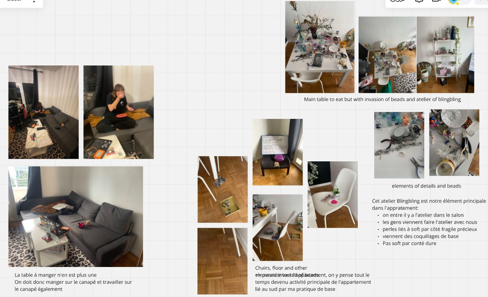
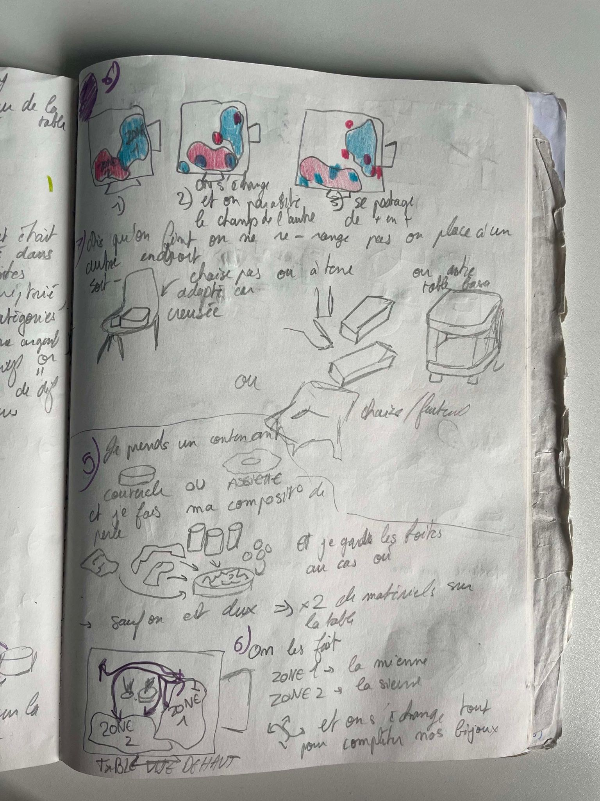
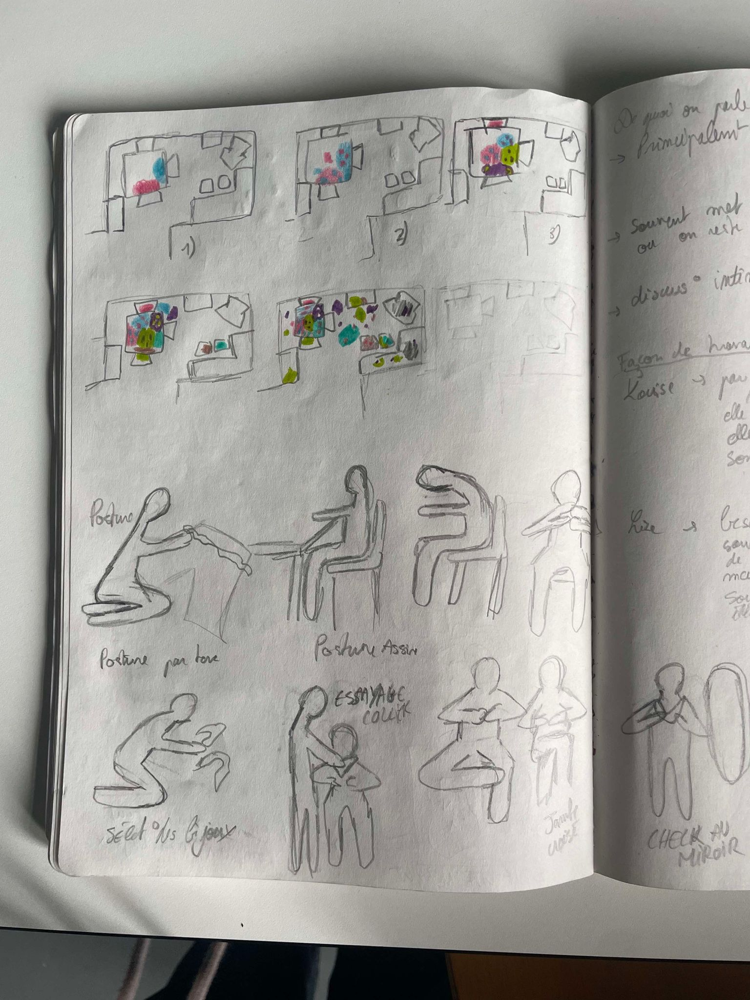

# Lise Mendes
- Soft Robots - Bling's assistant
- Master Media Design + O2R

## Area of intervention
I am focus on passioned activities in our place/intimate space and took the example of my own practice of making jewerly with my roomate, especially with beads.
on my practice of making jewerly with my roomate, especially with beads, that re-organised and structured the space of my appartment.

One sentence to describe what you are focusing on, inside the domestic space. For example: "Avoidance strategies in a shared collective living space".

+ Key visual (from your field research)
+ Optional second visual

## Research Question
How my space adapted to our practice? In general, how a passionate activities can influence an organization of our own space?

How is the organisation of my appartment with this practice? What are the adptation?
How can we explain these behaviors? What are the consequences?

One or two setences, describing questions that your project evokes. For example: "What new relationships can we have with traditional altars?"

## Research

I have listing the materials and elements related to our practice within my apartment. 

I analyzed how the apartment is organized and how this practice affects that organization. I observed how I work during this activity, as well as how my roommate does. 

I looked at our positions, what we talk about, and what we listen to while working. I took a lot of pictures and videos to analyze our practice and keep the conversation and the sound. I noticed that we tend to spread out and overwhelm the space, so I mapped how the space evolves over time. 

I concluded that we’re quite messy with this practice. Indeed, beads and other materials are scattered throughout the apartment, spreading everywhere like a kind of "contagion." We even have no chairs left because we’ve placed beads on them. Finally, I observed that we have two different working styles: she prefers working on the floor, while I prefer the table.

Describe in a short paragraph (~1000 chars) the research that you have conducted around your core questions. Mentions your research methods: interviews, observations, questionnaires, et cætera. Illustrate each method with corresponding data, photo, sketches, audio, movies, etc. You can put a lot of elements here, but please curate the most illustrative materials.

## Insights
A passionate practice can bring the mess in a space. 
But this activity and the mess can be a source of ideas, and brings new aspect of work.

One, two, or three (max) insights from your research. Each insight described in one sentence. Example: "Pets can play the role of catalyst for resolving conflict in a couple".

## First ideas & prototypes
Show three of your prototypes.

### Bobine
Bobine is a lovable, clumsy assistant who eagerly tries to help but ends up creating chaos. With a soft, slightly sticky form that unintentionally spreads beads, he mimics your actions, though often misplaced. Bobine adds humor and spontaneity to every creative session.

Short paragraph (~250 chars) describing the prototype.

+ One photo of the prototype (can be gif animation, or static)
+ One storyboard of the prototype
+ (Optional) Audio
+ (Optional) Video

### L’Observateur Curieux – The Silent Observer

Short paragraph (~250 chars) describing the prototype.

+ One photo of the prototype (can be gif animation, or static)
+ One storyboard of the prototype
+ (Optional) Audio
+ (Optional) Video

### Name of third prototype

Short paragraph (~250 chars) describing the prototype.

+ One photo of the prototype (can be gif animation, or static)
+ One storyboard of the prototype
+ (Optional) Audio
+ (Optional) Video

## Next Steps
In one sentence, describe what you will focus on next.