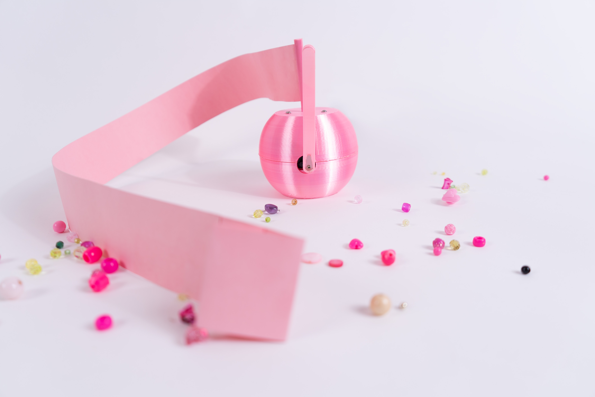
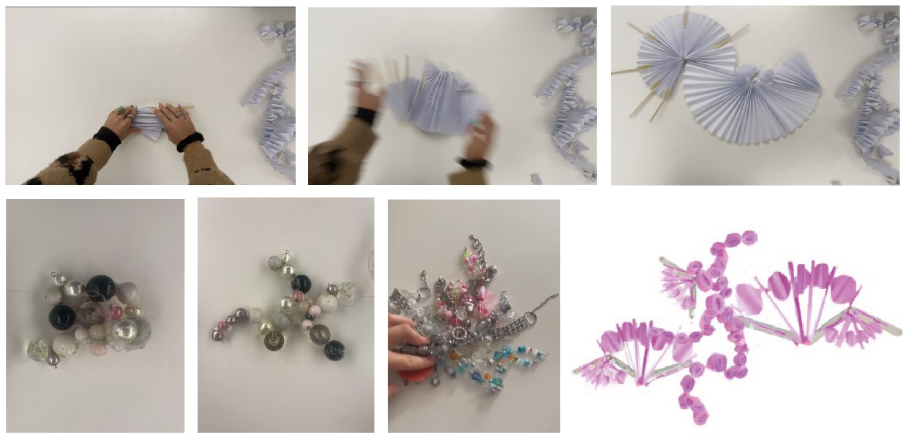

# Project Description

BomBine, the unpredictable assistants that make your creations funnier and messier! What kind of relationship can we have with a robot that mirrors our messiness in our passionate creative practices?
My project is an assistant that spreads and amplifies disorder in a creative space at random times. Its purpose is to disrupt your workflow and encourage you to rethink your project through the chaos and remix it creates.

The target audience includes creative individuals and artists in their workplaces or studios. These robots will let you work and, at a certain point, activate themselves. They will roll out, sweep through your workspace, and eventually roll back in, repeating the process. Over time, they will enroll, sweep, and spread disorder in your creative space. 

You can’t be angry with it because overall, it is a nice robot that want you to have breaks and help you in your process of work. Also it is so cute! It has several colors such as pink, blue, green shiny.

# User Journey

The user is engaged in their creative activity (e.g., making jewelry with beads) at their workspace when the robot activates. After 15 minutes to 1 hour of work, the robot will «explode,» sweep through, and disrupt your workspace. This process re-mixes your materials and project, while also encouraging you to take a break.

However, you don’t feel angry at the robot because it’s simply too cute to blame.

# Field observations 

My field observation focuses on passionate activities in intimate spaces, using my jewelry-making practice with my roommate as an example, especially working with beads. 

I analyzed how our apartment is arranged, noting how this practice affects its organization—our positions, conversations, and even the music we listen to while working. I found that this activity creates significant mess: beads and materials scatter everywhere, even covering chairs.

Passionate practices can bring chaos to a space, but this mess can also inspire ideas, such as designing a soft robot that introduces new dimensions to creative work.

# Visual and Material Moodboard

The main idea behind the robot is to create a surprise effect—something that expands and takes up a lot of space. The robot must be colorful and look like a funny creature or object to prevent users from feeling frustrated. It should reflect our messiness and sense of humor.

# Shape research

# Paper Prototypes

My paper prototype explores spiral movement and form. The spiral needs to roll and unroll, but on what base? How can I conceal the electronics? What should the base look like to create the spiral motion? These are the key questions addressed during paper prototyping and field research.

Through extensive testing of size, height, and movement, I decided to use a small round ball design, with the electronics hidden inside, with a spiral on top.

# User Tests

During testing day, I received a lot of feedback and suggestions for my robot. Starting with its shape—it looks like a bomb. Which is a good thing, because it is by its a concept a bomb, so keep this idea. They said that movement might be too strong. But I keep has it was because I thought that is not too strong.
What about the timing for the explosion? Should it occur every 40 minutes? 15 minutes? I keep a random time from 15 minutes to 1 hour.

# Electronics

# Plan Drawings

