# Lise Mendes
- Soft Robots - Bling's assistant
- Master Media Design + O2R

## Area of intervention
I am focus on passioned activities in our place/intimate space and took the example of my own practice of making jewerly with my roomate, especially with beads.

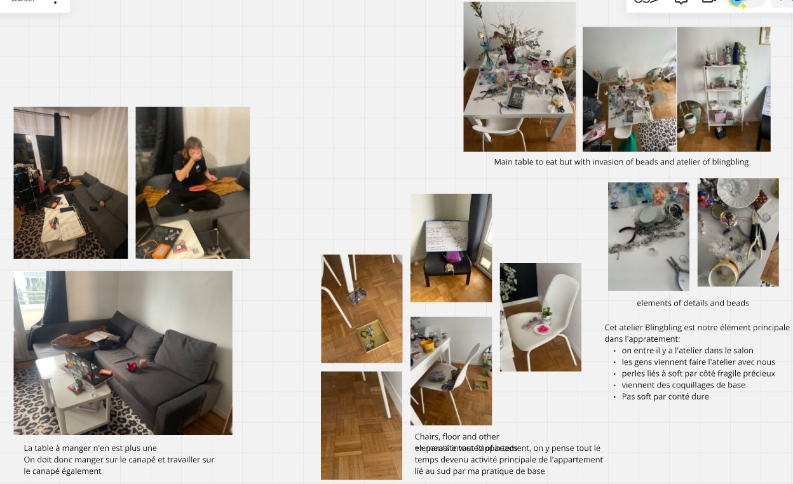
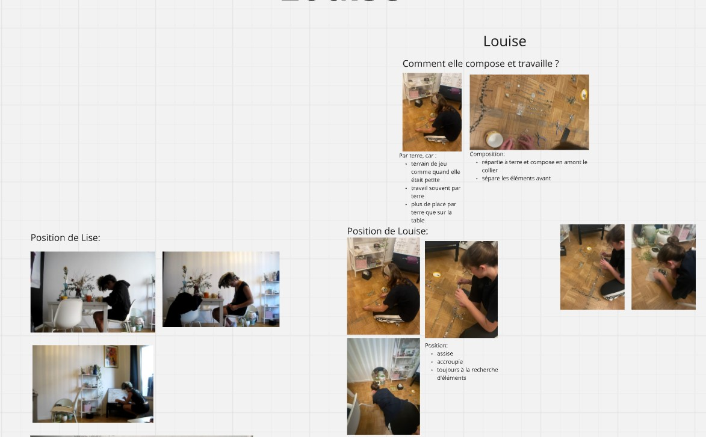

## Research Question
How my space adapted to our practice? In general, how a passionate activities can influence an organization of our own space?

## Research

I have listing the materials and elements related to our practice within my apartment. 

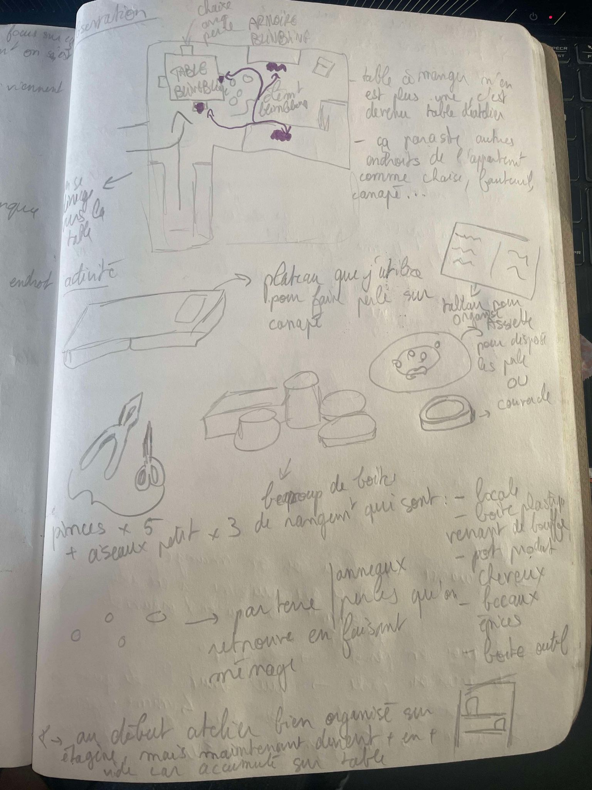

I analyzed how the apartment is organized and how this practice affects that organization. I observed how I work during this activity, as well as how my roommate does. 

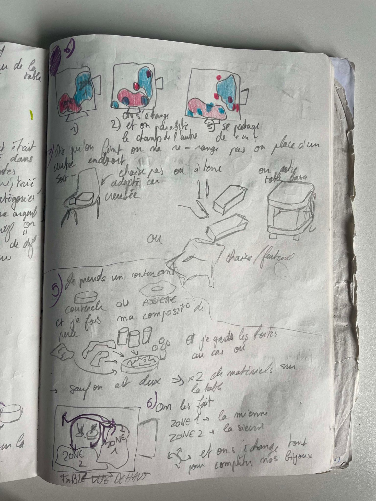

I looked at our positions, what we talk about, and what we listen to while working. I took a lot of pictures and videos to analyze our practice and keep the conversation and the sound. I noticed that we tend to spread out and overwhelm the space, so I mapped how the space evolves over time. 

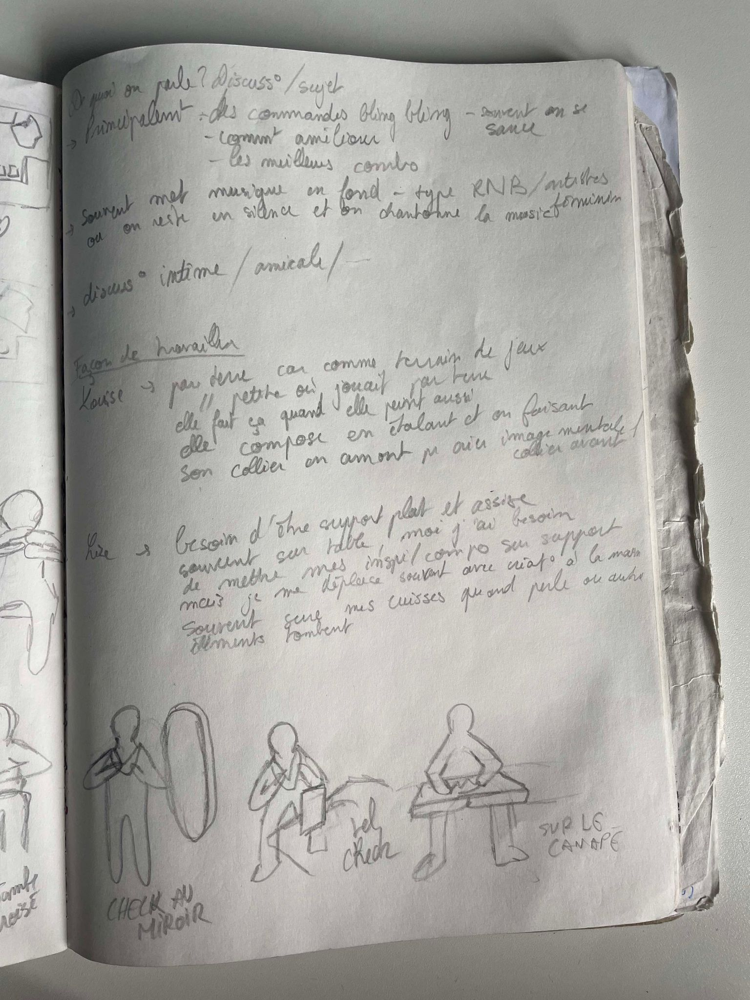
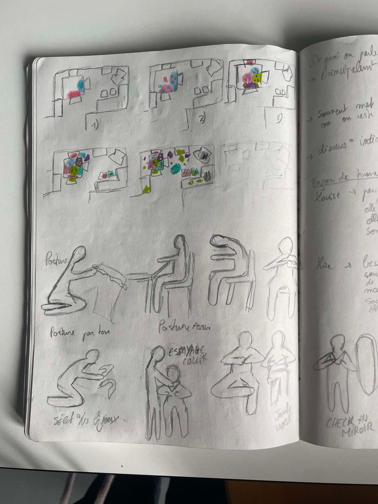
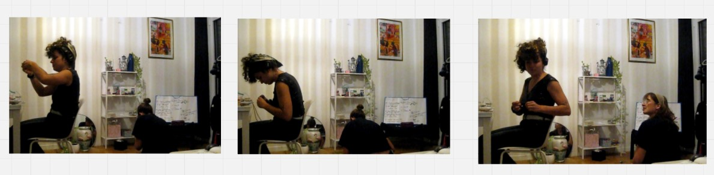

I concluded that we re quite messy with this practice. Indeed, beads and other materials are scattered throughout the apartment, spreading everywhere like a kind of "contagion." We even have no chairs left because we ve placed beads on them. Finally, I observed that we have two different working styles: she prefers working on the floor, while I prefer the table.

## Insights
A passionate practice can bring the mess in a space. 
But this activity and the mess can be a source of ideas, by making a soft robot and brings new aspect of work.

## First ideas & prototypes
Show three of your prototypes.

### Bobine
Bobine is a lovable, clumsy assistant who eagerly tries to help but ends up creating chaos. With a soft, slightly sticky form that unintentionally spreads beads, he mimics your actions, though often misplaced. Bobine adds humor and spontaneity to every creative session.

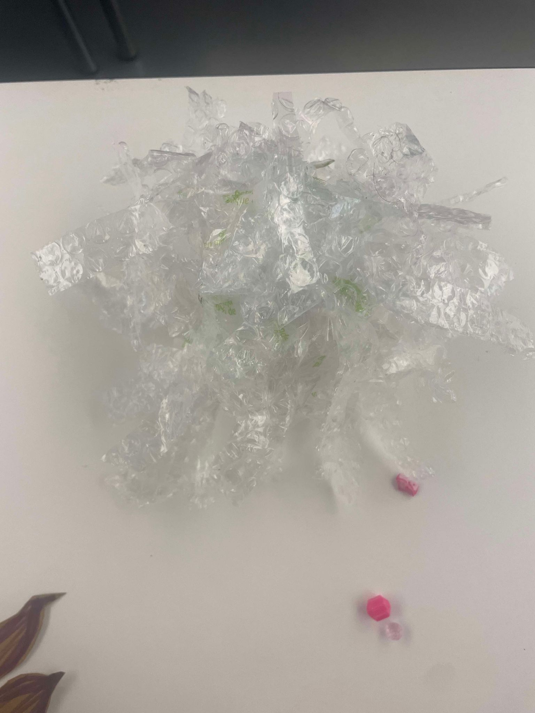
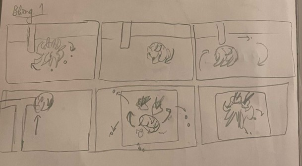
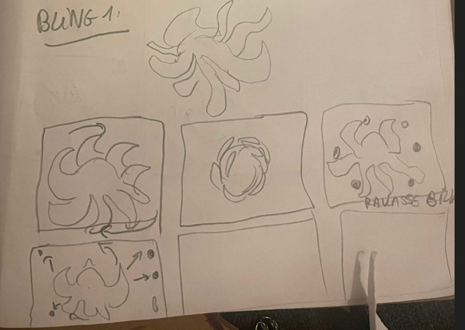

### L’Observateur Curieux – The Silent Observer
This assistant looks like an insect, with glowing eyes, silently following every move. Fascinated and curious, it looks at us and plays some music to be relaxed. Discreet yet always nearby, it feels like quiet companion.

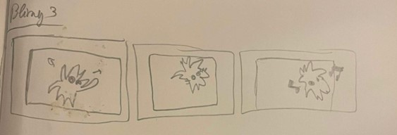

### Marc too excited 
This assistant is a lively, hyperactive who eagerly joins in but creates chaos. With a round, bouncy form and pulsing lights, it zips around, scattering beads and tools. Both inspiring and distracting, it energizes the workspace.

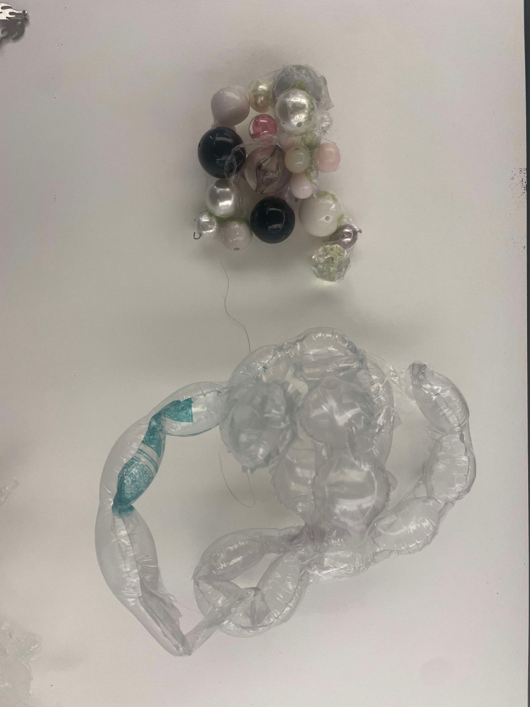
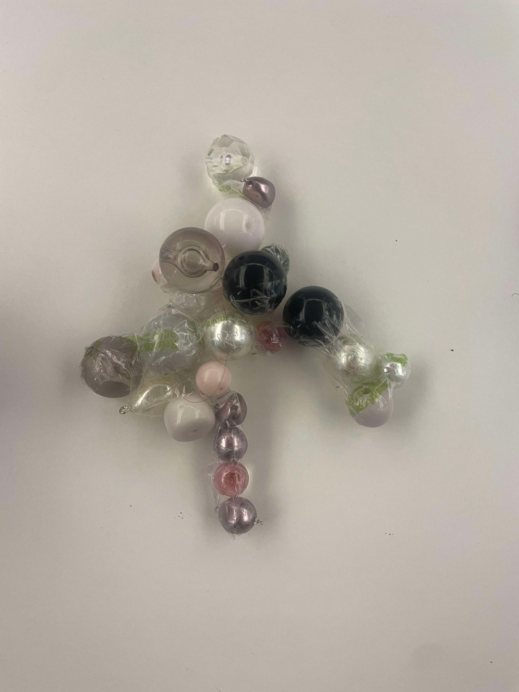
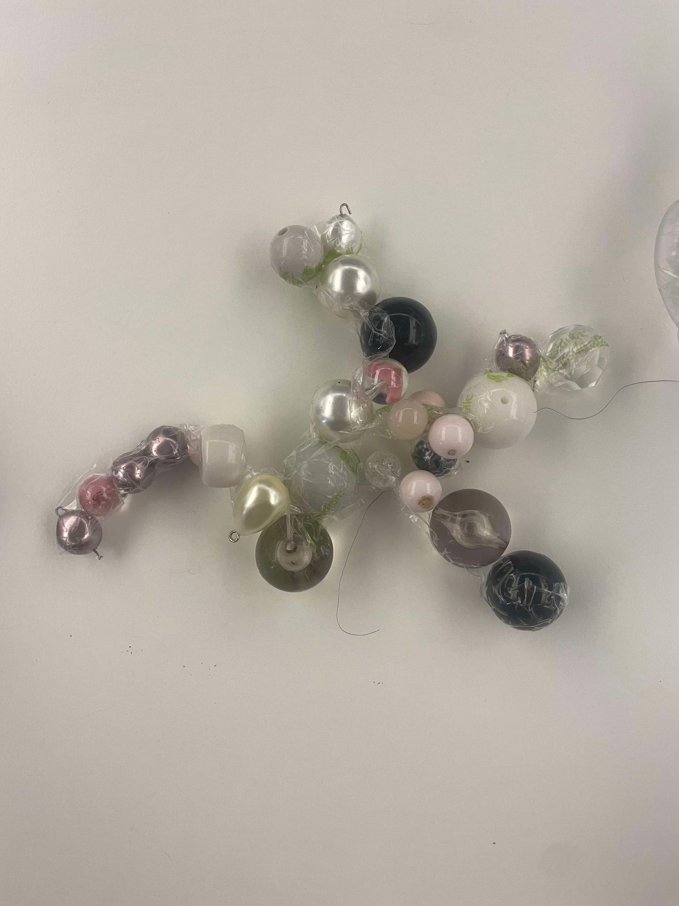
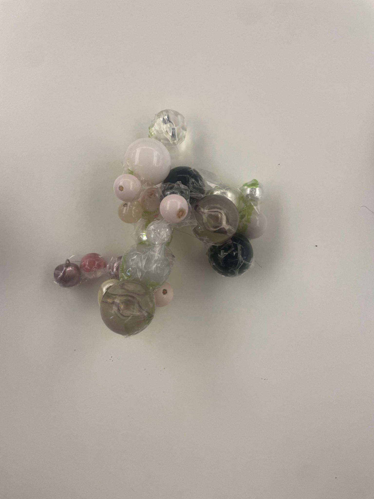
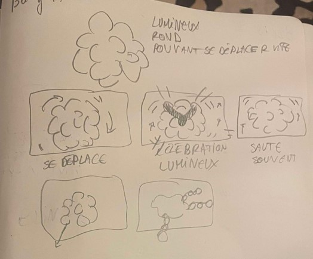
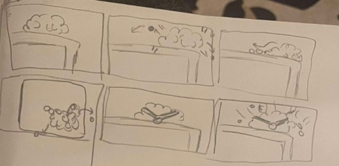

## Next Steps
I will focus on the composition, and de-composition of the robot by the elements that it takes in his spaces.