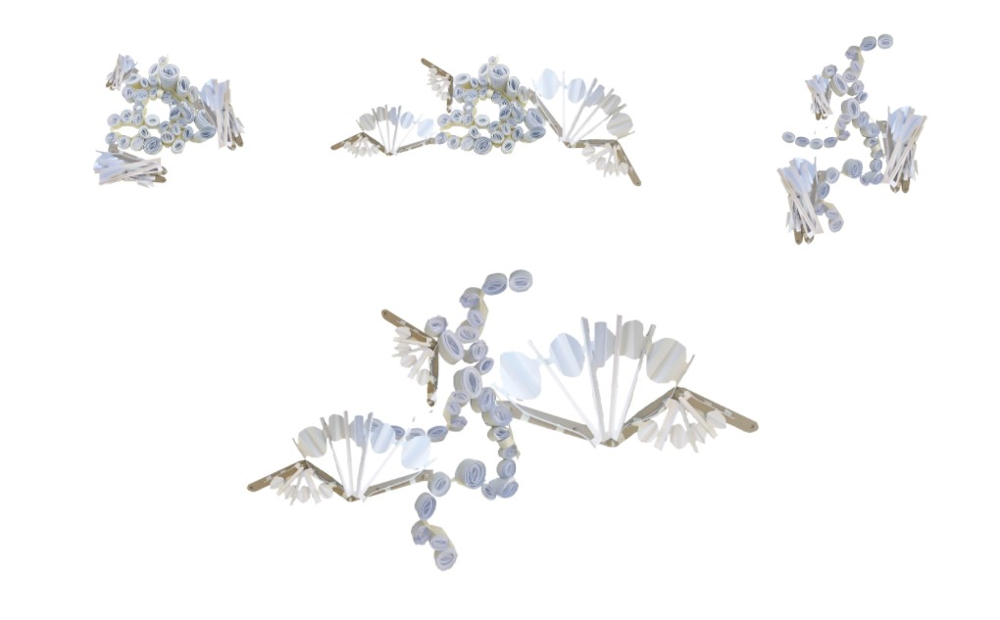
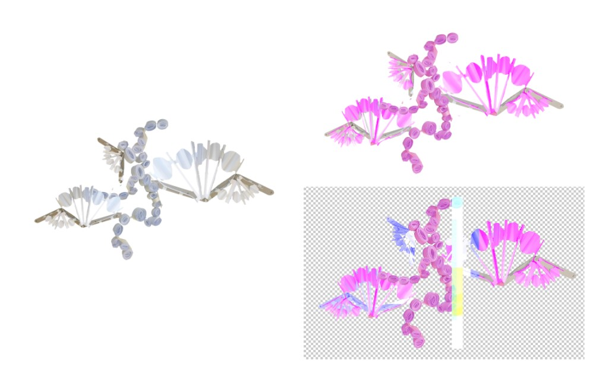
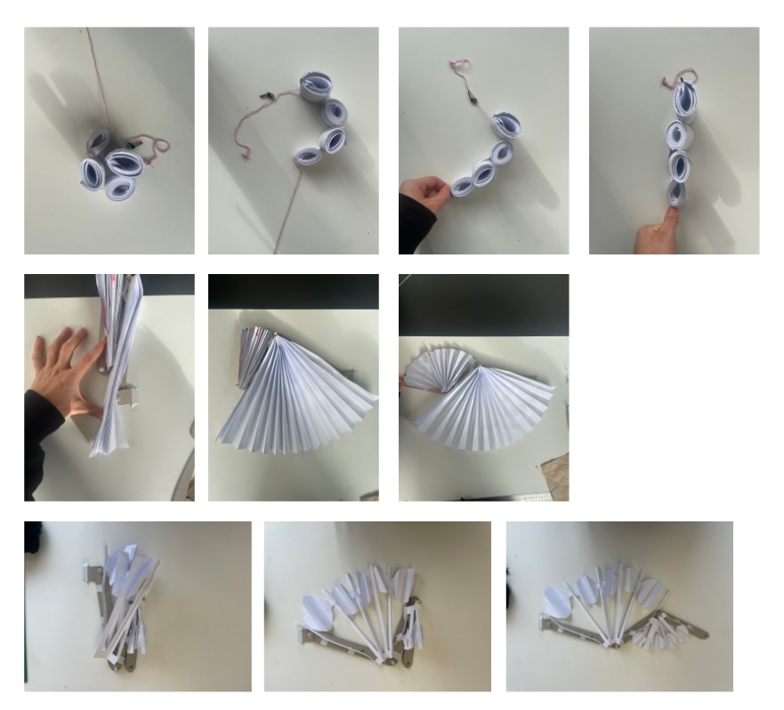
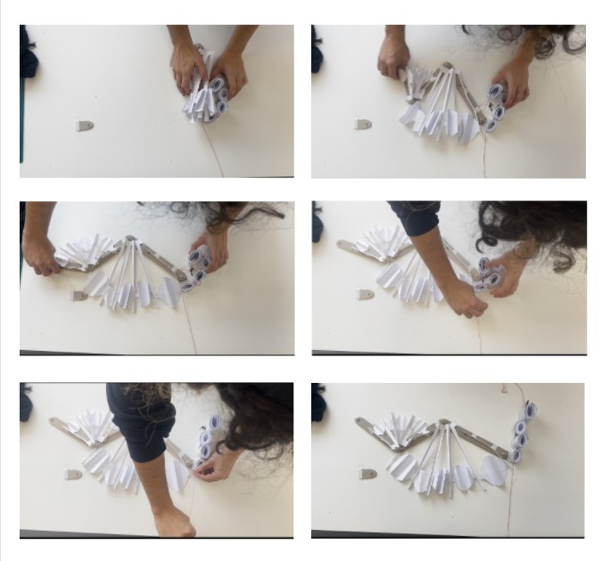
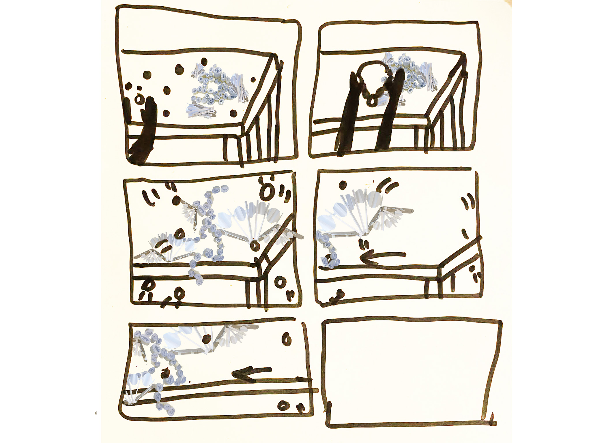

# Lise Mendes
- Soft Robots - Bling's assistant
- Master Media Design + O2R

# Project title: Bobine
The unpredictable assistant that makes your creations funnier and messier!

# Research Question / area of research
What kind of relationship can we have with a robot that mirrors our messiness in our passionate creative practice?

# Pitch
My project is an assistant that spreads and amplifies disorder in a creative space.

# Prototyping research
I envisioned a robot with two main types of interaction/movement. First, it can move its main body using an articulated skeleton. Additionally, it has "arms" stick to its main body that can appear instantly. The idea is to "sweep" a large surface, the workspace, by surprise.
The arms move like a fan, and the skeleton is composed of several circular components. I experimented with these different movements.

# Your key prototype
The robot assistant is calm and stationary most of the time. However, when you are engaged in your creative activity or presenting your work, it can become super excited and activate itself unexpectedly, taking up a lot of space. When activated, the robot sweeps and spreads elements around it.
You can’t be angry with your robot because it is too cute—and in a way, it helps you. By spreading and sweeping elements, it mixes and disorganizes your workspace, but it can also provide a fresh perspective and bring renewal to your work.

# User scenario

# Next Steps
I plan to explore the electronic aspects while considering the mechanical design. Additionally, I will test new colors and create a cleaner prototype.