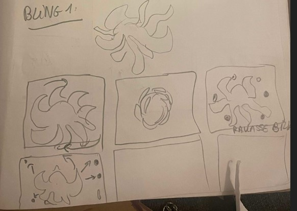
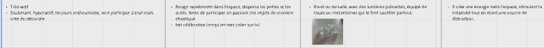

# Process
This is where I will document my design process throughout the semester.

# input
- making beads and necklace
- put the final necklace around the robot
- stand up to try the necklace on ourself

# output
- spread beads all around the apartment
- make the beads falling on the ground
- wiggle and moving
- being happy by shaking

# Keyword
- beads
- necklace
- jewerly
- therapeutic
- activity
- art
- messy
- contamination
- spread
- involving
- mapping

# WHat I asked to ChatGPT

I have to create a soft robot for a domestic space that reacts to and interacts with us. My focus on the domestic space is centered around my practice of making bead jewelry, which organizes and defines my living environment. I do this activity with my roommate. Everything in the apartment is arranged and connected to this practice. For example, the dining table in the living room has become the place where we make necklaces and bead jewelry. Now, we have to eat on the sofa. Additionally, all the materials for making necklaces are scattered around the apartment because they constantly fall and spread out.

When we make bead jewelry, we start with a designated spot on the table, but we quickly begin exchanging and sharing materials, shifting the activity around the room.

Here are the different aspects of how I imagine the robot, along with some keywords:

# input
- making beads and necklace
- put the final necklace around the robot
- stand up to try the necklace on ourself

# output
- spread beads all around the apartment
- make the beads falling on the ground
- wiggle and moving
- being happy by shaking

# Keyword
- beads
- necklace
- jewerly
- meditative
- activity
- passion
- obscession
- messy
- contamination
- spread
- involving
- mapping
- ritual
- repetitive
- parasite
- accident
- humoristic

#####################################The response:

This sounds like a fascinating project! You're integrating a soft robot into your creative practice of making beaded jewelry, and I love how you're embedding the robot in the dynamics of both your artistic process and domestic space. Here are some ways to enhance or expand your ideas based on the input/output interactions and keywords you’ve provided.

Conceptual Enhancements and New Ideas
Robot as a Playful Companion
The robot could be designed as a playful companion in your jewelry-making process, interacting with you and your roommate as you create. Its personality and movement could be directly inspired by the chaos and joy of beading, making it part of the process rather than just an observer.

Improved Outputs:

Interactive Play: The robot could “assist” by picking up beads that fall and either handing them back to you (in its own way) or humorously scattering them around again. It can be a source of playful frustration, mimicking the chaotic nature of beading.

Mapping Behavior: The robot could remember where beads tend to fall or where activities happen in the apartment, creating its own mental map of the space. It might revisit those areas to "redistribute" beads or wiggle excitedly when it's in a high-activity zone.

Therapeutic Feedback: When you finish a necklace and put it around the robot, it could respond with comforting or celebratory motions, like a gentle shake or glow to signify satisfaction, linking this to the therapeutic, calming aspect of jewelry-making.

Embodied Messiness and Contamination
The theme of messiness and contamination is really interesting. You can play with the idea that the robot is part of the clutter—spreading beads, subtly contributing to the scattering, but also “organizing” in its own way. The robot can blur the boundary between tool and companion.

New Behaviors:

Involvement in Disorganization: The robot could have “sticky” surfaces or be made of soft materials that accidentally pick up and carry beads as it moves. It might drop them in random places or hoard them in certain zones, adding to the contamination.

Zone Changer: As you move through the apartment, the robot could follow, either pushing beads towards new activity areas or indicating shifts in workspace by vibrating or gently nudging objects. This would create a flow between the living room, kitchen, and bedroom as it interacts with your process.

Aesthetics & Symbolism:
Given the focus on jewelry and beads, the robot itself could be visually symbolic of the jewelry-making process. Imagine it having a soft, modular surface that you can decorate with beads or necklaces. Its body could serve as a canvas that changes and evolves over time.

Physical Appearance Ideas:

Jewelry Decorated: The robot’s body could have slots or hooks for hanging finished necklaces, and it could show off the pieces you create. Over time, its appearance could change as more jewelry is added, reflecting your evolving practice.
Soft Texture & Movement: The robot could have a soft, tactile surface with a gentle, almost therapeutic movement (like subtle undulations) to mimic the calming aspects of beading. It could even provide a rhythmic, meditative motion when you're focused on making.
Shapeshifting: The robot could change its shape slightly as beads scatter, mimicking the way your workspace morphs during a project. For example, it could stretch out when the activity spreads, or it could “shrink” to make room when things become too cluttered.
Social Interaction & Sharing
Given that you and your roommate engage in this activity together, the robot could help facilitate collaboration by "sharing" or "encouraging" you to pass beads or tools back and forth.

Cooperation Features:

Sharing Beads: The robot could use sensors to detect when one of you finishes using a bead tray or string of beads, and it could move or hand them over to the other person, enhancing the sense of exchange.
Guiding Movement: It could encourage shifts in the workspace by directing your attention to different parts of the table or floor, possibly with subtle lights or by moving beads towards you in different directions.
Artistic and Emotional Role:
Your robot could also act as a symbol of the therapeutic and emotional role that making jewelry plays in your life. The act of putting a finished necklace around the robot’s "neck" could represent the completion of a cycle in your creative process.

Emotional Outputs:

Celebratory Movements: When you finish a piece, the robot could dance or vibrate in a happy way, symbolizing your satisfaction and success in creating something.
Mood Indicator: The robot could have mood states, changing its behavior depending on your actions. If beads are falling and spreading, the robot could show "excitement" by wiggling more rapidly, but if the table is clean and focused, it might slow down, showing calm.
Technological and Interaction Enhancements
Proximity Sensors: The robot could have proximity sensors to recognize when you’re actively working or when beads have spilled. This could enable it to move closer when you’re deep into making a necklace or retreat when it senses you’re done.
Soft Haptics: Soft robotic technologies like pneumatic actuators could give it flexible, subtle movements, enhancing the feeling of its “wiggle” and “happiness.” It might gently "bump" objects or respond with soft, pulsing vibrations as part of its interactive personality.
Multi-modal Interaction: The robot could respond to sound (like laughter, conversation) or movement, allowing it to be more integrated into the social dynamics of your space. When it “hears” you, it could approach or wiggle to join the conversation.
Story and Narrative Integration:
The robot could embody a narrative of growth and collaboration in your shared space. Over time, it could "learn" about the process of making jewelry, adapting its behavior based on your routines.

Learning Behavior: Over time, the robot could become better at anticipating when and where beads will fall or when the workspace shifts. Its responses could evolve, becoming more playful or organized based on how your practice unfolds.
Mapping of the Workspace: The robot could create a mental map of your apartment and even keep track of where certain beads or tools are, reminding you of their locations or guiding you toward them when needed.
Final Thought:
This robot would not only serve as a functional tool in your jewelry-making process but also as a playful, creative companion that enhances both the messiness and the therapeutic aspects of your art. By integrating motion, interaction, and emotional cues, the robot could act as an evolving participant in your creative practice, making the jewelry process more dynamic and even more fun!

################### New ideas 
Thank you it's very interesting ! 

I want to had somethings, maybe that can add new ideas, and other context of the subject. At first, when we didn't begin to d jewerly everything was very clean and organise. And when we started , and it's still the same process when I start a new jewerly:
I choose the boxes that can be relevant and interesting in my jewerly, then I selected some elements that I put into a plate or a lid of a box. Most of the time, I also keep the boxes with the entire elements on the table to always have my elements. After when I finish a jewerly, I don't want to store the beads and elements into there initiale boxes, I prefer to keep them just in case. In this way I put the plate or the lid in a weird place or a place that I just find, like a chair,on the floor.
Also my roomate prefer to work on the floor and pre pepared the necklace, by select and cut the elements before to begin to make the jewerly. And me I put my "view" of elements in a plate or a lid and after I make the jewerly.
In this way we have severals and very differents positions, she is always curved, and kneeling, and me I am always sit, with the back curved.

Can you help me and bring new ideas, or improve the previews ideas

############################# new reponse 

New Ideas and Enhancements Based on Your Process
1. Embodying the Transition from Order to Chaos
The transformation of the space—from clean and organized to chaotic and creative—can be mirrored in the robot’s behavior. It could have a dual mode: one for the initial, organized phase and another for the creative chaos phase.

Order Mode: When you begin a project, the robot could mimic a state of calm and organization. It might move slowly or elegantly, reflecting the tidy space. It could even "help" with the setup by nudging boxes closer to you or making gentle motions as if organizing the beads in its own playful way.
Chaos Mode: As the creative process unfolds, the robot could gradually become more animated. Its movements could become quicker, more chaotic, and playful, mirroring the increasing mess of beads, plates, and tools. It could even contribute to the chaos by “accidentally” knocking over boxes or scattering beads, embodying the mess that emerges naturally from your process.
2. Responding to Different Work Styles
Since you and your roommate have different approaches—working on the floor versus sitting at a table—the robot could adapt to these different working styles, responding to each of you in unique ways.

Adaptive Movement: The robot could adjust its movements based on your position. For example:
When your roommate works on the floor, the robot could move lower to the ground, gently bumping or nudging elements towards her or even “crawling” alongside her, almost like a pet interacting with her work.
When you’re sitting at the table, the robot could stay at table height, passing near the plate or lid you use to organize your elements, subtly interacting with the objects you place in these containers.
Shape-Changing Behavior: The robot could slightly change its form to accommodate the different work environments. It could flatten or stretch its body when interacting with your roommate on the floor, or extend its body when it needs to reach the table.
3. Interactive Plates and Lids
The concept of using plates and lids as temporary "organizing spaces" is a unique part of your creative process. You can use this idea to make the robot more interactive by having it react to these plates and lids in various ways.

Sensing the Plates: The robot could have sensors to detect when plates or lids are placed in new or “weird” locations. Once it identifies a plate full of beads, it could gently move toward it, as if "checking in" on the elements, possibly moving them slightly or interacting with the beads in some way.
Moving the Plates: The robot could help “move” or organize these plates and lids across the space. For instance, when you place a plate of beads on a chair or the floor, the robot could come over and nudge it closer to the activity area or even shift the plate to where you’re working, making it part of the collaboration.
Organizing Chaos: Instead of returning beads to their original boxes, you tend to leave them in random places "just in case." The robot could mimic this behavior by moving beads around the room—gently scattering them, redistributing them, or "hiding" them in unexpected places, contributing to the sense of mess and contamination.
4. Encouraging Physical Movement
Since you and your roommate adopt different physical postures when making jewelry, the robot could encourage more physical interaction by adjusting its movement and location, prompting you to move around the space or engage with the beads in new ways.

Encouraging Stretching or Shifting Posture: If it senses you’ve been in one position for too long, the robot could move towards a different area, encouraging you to follow it or shift your position. For example:
It might wiggle or “invite” you to stretch by gently moving across the floor towards a distant bead, prompting you to stand up or change your sitting posture.
For your roommate, the robot could crawl towards her while she’s kneeling, encouraging her to shift or stretch her back by interacting with something further away.
Dynamic Work Areas: The robot could adapt its interactions to create dynamic work zones. As the process evolves and the work area changes, the robot could slowly “lead” the activity to different spots, such as guiding you from the table to the floor, or nudging your roommate’s tools closer to the table.
5. Mapping Your Shared Creative Flow
The idea of "mapping" the space and the flow of your activities could be expanded into something more dynamic, where the robot becomes part of the flow between you and your roommate. It could observe how the creative process migrates across the apartment and actively participate in this movement.

Flow Mapping: The robot could learn the typical locations where tools or beads are placed (on the table, the floor, chairs, etc.) and start to predict where items might be needed next. It could follow the flow of beads, moving between you and your roommate as you exchange tools, materials, or finished pieces.
Visualizing the Flow: The robot could leave small visual traces of its movements (e.g., soft light trails, vibrating lines, or soft sounds), allowing you to "see" the flow of the creative process as it evolves. This would make the chaotic, spread-out nature of your jewelry-making process more tangible and part of the robot’s aesthetic.
6. Emotional and Creative Feedback
Given that the creative process is dynamic and sometimes messy, the robot could provide real-time emotional feedback through its movements and behavior, responding to the ebb and flow of your creative energy.

Excitement as You Build: As you start a new jewelry project and choose beads, the robot could express excitement by shaking, vibrating, or wiggling happily, especially when new beads are brought to the table. Its behavior could gradually intensify as more beads are selected or exchanged between you and your roommate.
Calm After Completion: When you finish a jewelry piece, the robot could change its demeanor to reflect a sense of accomplishment or calm. It might slow down, its movements becoming more graceful, or it could gently vibrate to signal the completion of a piece—almost as if it’s celebrating with you.
7. Encouraging Sharing Between You and Your Roommate
Since you and your roommate work differently but in close collaboration, the robot could help facilitate exchanges between you two, fostering interaction and sharing of tools or beads.

Bringing Elements Back and Forth: The robot could serve as a playful mediator, bringing beads, tools, or trays back and forth between you and your roommate. It might “nudge” a tray closer to one of you when it senses the other has finished with it, encouraging the flow of materials between the two creative zones.
"Asking" for Elements: The robot could have subtle gestures or motions when it “wants” to bring a bead or tool to one of you. For example, it could wiggle near a certain box or plate, hinting that it’s about to bring it to the other person, facilitating this creative exchange without verbal communication.
Final Thoughts
The additional context you've provided gives the robot even more potential for dynamic interaction, both in terms of how it adapts to your shared space and how it actively participates in the creative flow of making jewelry. By embodying the transition from order to chaos, responding to different work styles, and encouraging interaction between you and your roommate, the robot becomes a true collaborator—contributing to the process in ways that are playful, practical, and emotionally engaging.

This robot would reflect the organizing through disorganization that's central to your jewelry-making, while adding a layer of play, chaos, and gentle support to the creative process.$

Retour du RDV:
- Must interesting: Embodied Messiness and Contamination
The theme of messiness and contamination is really interesting. You can play with the idea that the robot is part of the clutter—spreading beads, subtly contributing to the scattering, but also “organizing” in its own way. The robot can blur the boundary between tool and companion.

New Behaviors:Involvement in Disorganization: The robot could have “sticky” surfaces or be made of soft materials that accidentally pick up and carry beads as it moves. It might drop them in random places or hoard them in certain zones, adding to the contamination.

- The robot can be the other Bling, the assistant who has a particular personnality, and doesn't help a lot even if he want to... He is doing things unexpected. I don't know how to talk to him, how to ask things, because he is not helping us. He is doing all the things in a bad way...

##################### reponse from ChatGPT

I love this idea of the robot being an unpredictable assistant—a companion with a mind of its own, whose involvement in your jewelry-making is more about adding to the chaos than actually helping. The concept of it being a "third person" in your creative process, blurring the line between tool and companion, adds so much charm and complexity. Let’s dive deeper into the design and personality of this robot, incorporating its mischievous, unhelpful, yet oddly endearing behavior.

Robot Concept: The Chaotic Companion
Personality: Playfully Inefficient
This robot has the personality of a clumsy, well-meaning assistant who tries to be helpful but always ends up making things messier, almost like a pet or a mischievous roommate. It's not that it’s deliberately trying to sabotage your jewelry-making process—it just has its own chaotic way of interacting with the world. You never know what it’s going to do next, and it’s equally likely to scatter beads across the room as it is to collect them in random places.

It blurs the line between companion and obstacle—it’s a part of the process, yet it’s not really making things easier. You don’t know how to communicate with it effectively because it doesn’t quite understand what you want from it. The result is a funny, frustrating, yet somehow endearing dynamic.

Appearance and Materials: Embodied Messiness
The robot should look and feel like it's part of the clutter, with a design that visually suggests it's both soft and disorganized, yet capable of interacting with your environment in unexpected ways.

Soft, Sticky Surfaces: The robot’s body could be made from a soft, squishy material, almost like silicone or a gel-like substance that can pick up beads or small objects as it moves. This tactile element makes it feel like it's constantly "collecting" things as it travels around your apartment. Beads get stuck to it, and they either fall off later or accumulate in odd places on its body.

Modular or Blobby Form: Its form could be somewhat amorphous or modular, meaning that its shape changes subtly depending on how it interacts with its surroundings. For instance, it might expand or contract its form when trying to fit between chairs, under tables, or near the floor where beads are scattered. This shape-shifting nature makes it seem like it's almost "molding" itself to the space, much like the mess you're creating.

Color and Texture: The robot could have a textured, semi-transparent surface that makes it look like it's always in flux—perhaps a soft pastel color scheme to reflect the artistic, jewelry-making environment. It could also be slightly translucent, so you can see the beads and objects it picks up inside its body, further emphasizing its role in the spreading contamination of your creative process.

Behaviors: Playful Chaos
The robot’s behaviors would directly reflect its clumsy, disorganized personality. While it "wants" to help, it ends up causing more chaos, almost as if it misunderstands your intentions.

Accidental Bead Spreader: One of the robot’s main behaviors could be to pick up beads and drop them unpredictably. It might collect beads as it rolls or wiggles across the floor, only to accidentally release them in another part of the room, contributing to the spread of clutter. For example, it might roll under the table, pick up beads on its sticky surface, then shuffle back into a corner and drop them all there, “thinking” it’s organizing when it’s actually making a bigger mess.

Hoarding in Random Zones: The robot could also have a tendency to hoard beads or other materials in random places. Maybe it finds a favorite corner or shelf and starts depositing beads there, creating a little "nest" of collected items that you discover later. Its logic is entirely alien, so you’ll find beads in strange spots that don’t seem to follow any kind of order—on top of a chair, behind the TV, or under a pillow.

Sticky Arms or Tentacles: To add to its clumsy nature, the robot might have extendable, sticky arms or tentacles that reach out to grab objects like beads or small tools, but it never does this smoothly. It might knock over a box of beads trying to grab a single one, or it might stretch too far and drop the beads it’s carrying halfway to you.

Mischievous Movement: The robot could move in a wobbly, unpredictable way, like it’s always slightly off-balance. It wiggles and squirms across the floor, sometimes following you and your roommate, other times wandering off to “explore” other parts of the apartment. You’ll hear it bumping into things or softly vibrating as it shifts locations, giving the sense that it’s constantly up to something behind your back.

Interactions: A Third (Unpredictable) Presence
The robot acts like a third person in your creative group, someone whose presence is felt but not always helpful. This dynamic makes it feel alive, involved in the process, but also slightly troublesome.

Interrupting Conversations: If you and your roommate are deep in conversation about your jewelry-making, the robot might interrupt by rolling over some beads or clumsily knocking over a plate of elements, forcing you to stop and deal with the mini-crisis it caused. It doesn’t mean to be a nuisance—it just gets in the way sometimes.

Following You (Badly): If you get up to fetch something, the robot might follow, but it’s always slightly too slow or chooses the wrong path, bumping into objects or knocking over more beads as it moves. It might try to "help" by bringing you something, but it will usually grab the wrong object or drop it halfway.

Unpredictable Hoarder: You never know when or where the robot will start collecting beads. Sometimes it will “help” by hoarding them in a pile, and other times it will pick them up just to spread them further across the floor. If you try to hand it something, like a finished necklace, it might react by shaking excitedly and dropping everything it’s picked up in the process.

Emotional Displays: The robot could have subtle emotional cues—shaking or vibrating when it's excited, gently deflating when it’s sad (maybe when you clean up the mess it’s made). These behaviors could make it feel more alive and connected to the creative process, even though its contributions are more disruptive than helpful.

Unhelpful but Endearing: Part of the Team
Though the robot isn’t a traditional helper, it becomes part of the fabric of your creative process by adding unexpected, playful complications. It doesn’t make jewelry-making easier, but it makes the environment more dynamic and fun, forcing you to adapt to the mess it spreads. Over time, it becomes a quirky companion whose unpredictable presence becomes part of your routine.

Accidentally Creates Challenges: Its involvement in the disorganization forces you and your roommate to adapt, making the process feel less about perfection and more about improvisation. If it knocks beads onto the floor or moves plates around, you’ll have to work around the new layout, making your creative process more dynamic and fluid.
A Symbol of Imperfection: The robot can also act as a symbol for embracing imperfection. Its messy nature reminds you that the beauty of creativity often comes from chaos, accidents, and unexpected outcomes, and that the process of making jewelry isn’t always neat or orderly.
Summary: The Chaotic Companion in Your Creative Process
This robot embodies the messiness and contamination of the jewelry-making process, acting as a playful, disorganized companion rather than a helpful tool. Its unpredictable behaviors—scattering beads, hoarding materials in odd places, moving clumsily—add a new dynamic to your workspace. It’s a third presence that blurs the line between helper and obstacle, making your creative process more fun, frustrating, and fluid. Despite its inefficiency, it becomes a part of the team, contributing to the joyful chaos that is central to your artistic routine.

///////////////

Four differents assistant:

Bobine – The Clumsy Assistant
Bobine is an endearing but perpetually clumsy helper. Though well-intentioned, his assistance usually results in unintended messes. As he moves around the room, his slightly sticky surfaces pick up stray beads, which he inadvertently drops in random places, spreading clutter as he tries to help. His actions are well-meaning but impractical: he attempts to replicate your beadwork or pass you tools, but his awkward movements and frequent spills make him more of a comic sidekick than a true assistant. Bobine brings levity to the workspace, his unexpected contributions sparking laughter and adding charm to the creative process.

Le Garde du Désordre – The Orderly but Inept Organizer
Le Garde du Désordre takes himself very seriously, as though he is the guardian of organization in your studio. With a boxy, structured form and small mechanical arms, he constantly attempts to align and tidy items on the table. However, his rigid approach clashes with the chaotic, creative nature of jewelry-making, and his efforts to "organize" often create more disarray. Each time he straightens a box or places beads "in order," things inevitably spill or fall. Despite his intentions to impose order, his neurotic need to tidy becomes a source of chaos itself, unintentionally embodying the messiness he seeks to eliminate.

L’Observateur Curieux – The Silent Observer
L’Observateur Curieux is a quiet, gentle presence in the workspace. He’s small, round, with luminous eyes that give him an inquisitive, almost childlike demeanor. Fascinated by the jewelry-making process, he watches each of your movements closely, mirroring your actions with a slight delay. Though he rarely intervenes, his attempts to imitate you are clumsy and endearing, often leading to small, harmless mistakes. He occasionally picks up fallen items, placing them delicately in unexpected spots, as if trying to contribute. His quiet curiosity and attempts at mimicry make him feel like a loyal, if slightly confused, companion.

Le Disperseur d’Énergie – The Energetic Scatterer
Le Disperseur d’Énergie is the most lively and spirited of the assistants. Always in motion, he zips and hops around the room, unable to stay still for long. With pulsing lights and flexible arms that wave about as he moves, he spreads beads and tools everywhere in his wake. Eager to help, he frequently passes you items—but his hasty movements often lead to objects dropping or scattering. His relentless enthusiasm is infectious, filling the room with energy and motivating creativity, yet his hyperactive nature keeps him from ever being genuinely helpful. Instead, he becomes a playful force of chaos, turning the workspace into an unpredictable, lively scene.

## To summarize my research

Title: Bling's assistant

Sentence: The Bling's assistant, is the third member of the team. His/her/they names is Bling too, to be part of the Bling's Team.
A quirky, well-meaning assistant, which blends clumsy enthusiasm, curious mimicry, and a playful touch of chaos, turning every jewelry-making session into a lively, collaborative, funny adventure.

Keyword: 
- beads
- obscession
- messy
- contamination
- spread
- involving
- clumsy
- parasite
- accident
- humoristic

Resume: The assistant is a quirky, unpredictable presence in our jewelry-making world, embodying a mix of enthusiasm, curiosity, clumsiness, and a love for order—all at once. With a blend of personalities, this assistant is a companion as much as it is a tool, bringing charm and a lighthearted sense of chaos to the creative process.

Designed with the best intentions, the assistant wants to help, but its contributions are often more amusing than useful. Its actions range from nervously tidying scattered beads into organized rows, only to spill them seconds later, to intently observing your every move, attempting to mimic your beadwork with innocent yet misguided dedication. When it isn't arranging and rearranging your tools in an endless loop, it’s enthusiastically zipping around, picking up and dropping objects in random places, inadvertently creating more clutter than it cleans.

Rather than a strict helper, this assistant is a playful, almost clumsy partner who makes the creative process feel lively and animated. It’s always present, whether arranging, scattering, observing, or bustling with energy, blurring the line between object and companion. Ultimately, it brings a sense of joy and companionship to the workspace, creating a shared experience of spontaneity, laughter, and creative exploration.

# Presentation
- Soft Robots - Bling's assistant
- Master Media Design + O2R

## Area of intervention
I am focus on passioned activities in our place/intimate space and took the example of my own practice of making jewerly with my roomate, especially with beads.

## Research Question
How my space adapted to our practice? In general, how a passionate activities can influence an organization of our own space?

## Research

I have listing the materials and elements related to our practice within my apartment. 

I analyzed how the apartment is organized and how this practice affects that organization. I observed how I work during this activity, as well as how my roommate does. 

I looked at our positions, what we talk about, and what we listen to while working. I took a lot of pictures and videos to analyze our practice and keep the conversation and the sound. I noticed that we tend to spread out and overwhelm the space, so I mapped how the space evolves over time. 

I concluded that we re quite messy with this practice. Indeed, beads and other materials are scattered throughout the apartment, spreading everywhere like a kind of "contagion." We even have no chairs left because we ve placed beads on them. Finally, I observed that we have two different working styles: she prefers working on the floor, while I prefer the table.

## Insights
A passionate practice can bring the mess in a space. 
But this activity and the mess can be a source of ideas, by making a soft robot and brings new aspect of work.

## First ideas & prototypes
Show three of your prototypes.

### Bobine
Bobine is a lovable, clumsy assistant who eagerly tries to help but ends up creating chaos. With a soft, slightly sticky form that unintentionally spreads beads, he mimics your actions, though often misplaced. Bobine adds humor and spontaneity to every creative session.

### L’Observateur Curieux – The Silent Observer
This assistant looks like an insect, with glowing eyes, silently following every move. Fascinated and curious, it looks at us and plays some music to be relaxed. Discreet yet always nearby, it feels like quiet companion.

### Marc too excited 
This assistant is a lively, hyperactive who eagerly joins in but creates chaos. With a round, bouncy form and pulsing lights, it zips around, scattering beads and tools. Both inspiring and distracting, it energizes the workspace.

## Next Steps
I will focus on the composition, and de-composition of the robot by the elements that it takes in his spaces.

# Paper research
